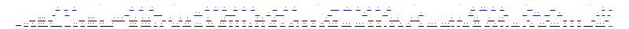

# AI Map Engine

## Languages

- [English](README_EN.md)
- [Polski](README.md)

## Description
This project aims to transform an existing game - written by me many years ago - from its original JavaScript implementation into Python. The initial goal is to transfer the game's mechanics and functionalities, but the primary objective is to enhance it with new possibilities through the application of machine learning techniques. The main focus is on exploring the topic, understanding the capabilities and limitations of using AI in game development.

The project consists of three main parts:

- Rewriting the game in Python: Transferring the game's logic and mechanics into Python, using suitable libraries for graphics handling and user interaction.

- Training a neural network to play the game: Developing a reinforcement learning model (Deep Reinforcement Learning, DRL) capable of learning strategies to maximize points scored in the game.

- Training a neural network for map creation: Developing a second DRL model responsible for generating game maps. These maps need to be sufficiently diverse to provide a challenge for the first network while offering a wealth of elements for interaction.

## Details
### Rewriting the Game in Python
- Maps: The game has the advantage (for this project) of creating a 'game world' from a mini-map where each pixel has a different meaning and is represented differently in the 'game world' depending on its color.
  - mini-map example:
  
    
- Choosing a graphics library: For implementing the game in Python, I decided to use the Pygame library, which offers extensive capabilities for creating graphical interfaces and event handling.
- Code modularization: In transferring the game's logic, I will introduce changes to divide the code into modules corresponding to different aspects of the game (e.g., game logic, graphics rendering, input handling), facilitating later changes and integration with neural networks.

### Training the Neural Network to Play the Game
- Algorithm choice: For deep reinforcement learning (DRL), I plan to use Policy Gradients (e.g., A3C or PPO).
- Environment simulation: The game must be used as an environment for the DRL agent, providing an API for performing actions and receiving observations and rewards.

### Training the Neural Network for Map Creation
- Generative Adversarial Networks (GANs): The first idea (to learn many things in one project) is to generate maps using GANs, where the generative network creates maps, and the discriminator (in this case, the network playing the game) evaluates them in terms of difficulty and interesting features.
- Customizing the loss function: To encourage the creation of maps that are challenging yet also offer the opportunity to score points, an appropriate loss function is needed to balance these aspects.

### Cooperation Between Networks
- The cost function as a connector: A key element of the project will be the cost function, which will allow communication between the networks. It must effectively balance the difficulty of maps with the ability to score points, aiming for equilibrium.
- Iterative optimization: This process will require many training iterations, where based on the results of one network, the other will adjust its actions. Manual adjustment of the weight of individual components of the cost function may be necessary to find the optimal balance.

## Technologies
- Python 3.11
- Pygame - for game implementation
- TensorFlow - for implementing neural networks

## Installation
Instructions for installing the necessary tools and libraries.

```bash
Copy code
# Clone the repository
git clone https://github.com/daniel-w-p/ai_map_engine.git

# Navigate to the project directory
cd ai_map_engine

# Install dependencies (example uses pip, but you can adjust to your needs)
pip install -r requirements.txt
```

## Running
### Running the game
```python main_game.py```

### Running the training for the network to play the game
```python train_agent.py```

### Running the map generation process
```python maps_generator.py```